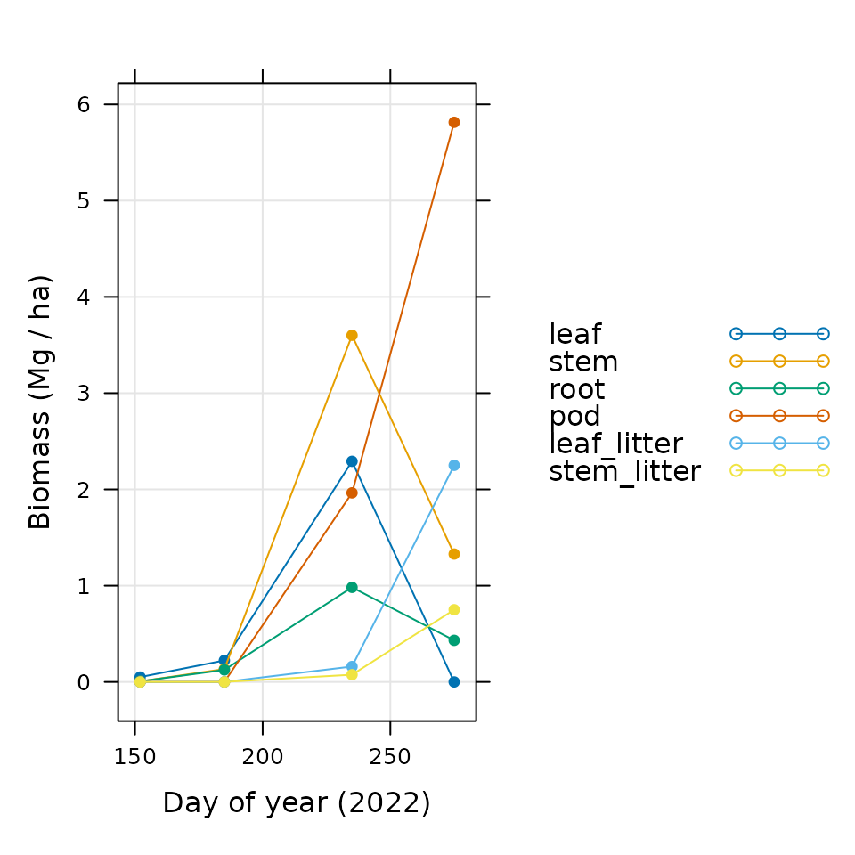

# Handling Biomass Measurements

## Overview

The `BioCroField` package includes several features related to measuring
and processing raw data from biomass harvests, with the ultimate goal of
producing values that are useful in the context of crop growth modeling.
In particular, the package includes the following:

- A crop harvest record sheet that can be used in the field to record
  relevant data.

- A document describing a general protocol for weighing dry tissue.

- Several crop-specific guides to harvesting and weighing tissue.

- An R function that accepts all the information from a crop harvest
  record sheet and stores it in a convenient data structure.

- Additional R functions that calculate key variables from the raw
  measurements and reorganize the results into a convenient format.

Together, these features provide a straightforward system for obtaining
data and for creating a full record of its analysis. After collecting
and measuring the plant material, a complete description of the data can
be created as follows:

1.  Store images of the completed crop harvest record sheets in a
    directory.

2.  Store the commands used to digitize and process the data (such as
    the ones in the [A Full Example](#a-full-example) section of this
    document) as an R script in the same directory.

3.  Save the final biomass data table as a plain-text file in the same
    directory using `write.csv`.

Now the final biomass values will be available in a simple CSV format,
and the exact steps taken to analyze the data will be clear to anyone
who looks at this directory in the future, including yourself! Even
though some details might not be immediately apparent from the script,
the documentation for the functions from `BioCroField` will describe how
the calculations were made.

The rest of this document explains the types of biomass measurements
that are important in the context of crop growth modeling (in the
[Biomass and Leaf Area](#biomass-and-leaf-area) section), the general
steps required to collect tissue in the field (in the [Harvesting
Material](#harvesting-material) section), the general steps required to
weigh the tissue (in the [Weighing Tissue](#weighing-tissue) section),
and how `BioCroField` can be used to process the resulting data (in the
[Processing Data with BioCroField](#processing-data-with-biocrofield)
section). The final section ([A Full Example](#a-full-example)) shows a
realistic example of how the functions from `BioCroField` can be used to
process a full biomass data set from a field season.

Throughout the document, we will provide several examples of R commands.
These examples will use functions from the `BioCroField` and `lattice` R
packages, which must be loaded first using commands such as the
following:

``` r
# Load required packages
library(BioCroField)
library(lattice)
```

If the `lattice` package is not installed on your R setup, you can
install it by typing `install.packages('lattice')`.

## Biomass and Leaf Area

When farmers and crop scientists want to compare the productivity of
different fields or varieties, they use a quantity called *yield*, which
can be defined as the amount of harvested material per unit area. This
is a loose and flexible definition; the type of harvested material
depends on the particular crop in question; the amount can be specified
as a volume, weight, or mass; and there are several systems of units
customarily used in different locations around the world. Nevertheless,
yield has proven to be a useful concept, at least partially because it
is an *intrinsic* property that does not depend on the size of the field
in which the crops were grown.

It is interesting to note that the harvested material *per plant* is far
less useful. As crops are grown at higher densities, competition between
the plants increases, and each plant tends to produce less output. Thus,
the harvest per plant depends not only on the crop’s inhererent
productivity but also the degree of competition between plants. On the
other hand, there is often a fairly wide range of plant *population*
(the number of plants per unit area) that can result in identical or
similar yield; for example, maize in Illinois sown between April 5 and
May 5 can reach 97% or higher of the maximum yield for populations
between 24,000 and 36,000 plants per acre ([Nafziger
1994](#ref-nafziger_corn_1994)). Thus, in most circumstances, the yield
(on a per area basis) better reflects the true productivity of a crop
without the complicating influence of competition.

In the context of crop growth modeling, we are typically interested in
predicting the yield (as a mass per unit area) of a particular crop
variety in a particular location. To do this, however, it is generally
necessary to predict the amount of other plant components (as masses per
unit area), such as the following:

- *Leaf*: The amount of leaf mass determines the amount of carbon the
  crop is able to assimilate through the process of photosynthesis, so
  leaf mass is critical for calculating growth rates.

- *Root*: The amount of root mass determines the amount of water and
  nitrogen the crop is able to obtain from the soil.

- *Litter*: As a crop ages, it begins to lose tissue through the process
  of senescence. Some of the lost mass is recycled to other parts of the
  plant, and the remainder is shed, forming the litter. The competing
  processes of growth and senescence determine the masses of components
  like the leaf and root.

- *Total*: Besides the components mentioned above, the crop also uses
  carbon to grow its stem and other reproductive material like flowers
  and pods. For accurate predictions, it is essential to accurately
  model the distribution of carbon throughout all the crop components.

Therefore, to validate a crop model, it is important to have
experimental measurements for all these crop components, ideally at
multiple times throughout a growing season. In addition to these masses,
it is critical to measure the *leaf area index* (LAI), defined as the
leaf area per unit ground area, which also plays a key role in
simulating photosynthesis at the canopy level ([Bréda
2003](#ref-breda_groundbased_2003)). If the model is able to reproduce
these mass and leaf area measurements, we can have more faith that it
will be able to make accurate yield predictions in other situations.

## Harvesting Material

To make measurements of these important quantities, it is necessary to
sow multiple plots and harvest plants from a single randomly-chosen plot
several times throughout a growing season, ending at the final harvest.
Each plot should also contain a wire mesh litter trap of known area, and
each harvest will generally include the following steps:

1.  Choose a section of a row with a known length; count the plants
    contained in the row section; cut each stem just above the ground;
    and collect all the above-ground portions of each plant in a bag to
    be dried and weighed. This can provide estimates for the population,
    the above-ground biomass (AGB) per unit area, and the AGB per plant.
    For this measurement, a length of row containing approximately 1-4
    dozen plants (depending on their size and spacing) should be used.

2.  Choose a smaller number of sequential plants (often half a dozen);
    cut each stem just above the ground; dig up and clean the roots of
    these plants; split the above-ground portions of the plants into
    components such as the stem, the living leaves, any senesced leaves
    still attached to the plant, and any reproductive parts like flowers
    or pods; and collect each separate component into a bag to be dried
    and weighed. Combined with the AGB measurements above, this process
    can provide estimates for the mass per area of each partitioned
    component. It also provides a second estimate of the AGB per plant
    that can be compared to the one determined in the previous step to
    determine whether the plants chosen for paritioning were
    representative of the plot as a whole.

3.  Measure the total area of the living leaves that were partitioned in
    the previous step. This process can provide an estimate for the
    *specific leaf area* (SLA), defined as the leaf area per leaf mass.
    Then the SLA and the leaf mass per unit area determined in the
    previous step can be used to estimate the LAI.

4.  Collect any litter that has fallen into the litter trap and put it
    in a bag to be dried and weighed. Combined with any senesced
    material still attached to the plant, this can provide an estimate
    for the litter formed through the process of senescence.

Note the importance of drying the collected tissue before weighing. The
wet weight can vary greatly throughout the day and does not give an
accurate reflection of the amount of material that has been truly
incorporated into the structure of a crop. For instance, two meters of
freshly cut sorghum plants often weighs more than two meters of freshly
cut maize plants, but the maize is often heavier after drying because
sorghum retains more water in its stems.

Pictures illustrating key parts of the harvest process can be found in
the [Images from the
Field](https://biocro.github.io/BioCroField/articles/web_only/images_from_the_field.md)
vignette (only available online).

### Crop Harvest Record Sheets

The `BioCroField` R package includes a carefully designed crop harvest
record sheet that includes clearly-labeled blank areas for recording all
of the harvest information described above. Each sheet represents the
harvest of one plot at one time. Using these sheets in the field will
help you stay organized, and will make sure your data is organized in a
way that will facilitate later analysis. The record sheet can be
accessed from R using the `access_sheet` function from `BioCroField` as
follows:

``` r
access_sheet('harvest')
```

The sheet is also available via the `BioCroField` [GitHub
website](https://github.com/biocro/BioCroField/tree/main/inst/sheets/).

When using this sheet, it is recommended to electronically fill out any
fields whose values are known beforehand (such as location, year, row
spacing, name, and contact) and then print out the necessary number of
paper copies you will need throughout a field season.

### Crop-Specific Guide Sheets

The details of harvesting are somewhat different for each particular
crop. The `BioCroField` R package includes crop-specific guide sheets
for several key crops with advice about harvesting them. These guides
can be accessed from R using the `access_sheet` function from
`BioCroField` as follows:

``` r
access_sheet('cowpea_guide')
access_sheet('grain_sorghum_guide')
access_sheet('maize_guide')
access_sheet('soybean_guide')
```

They are also available via the `BioCroField` [GitHub
website](https://github.com/biocro/BioCroField/tree/main/inst/sheets/).

When using these sheets, it is recommended to print out one copy of each
relevant crop guide so you can keep it on hand for reference while
harvesting.

## Weighing Tissue

Once the harvested tissue has been dried, it must be weighed. This is a
fairly straightforward process, but care must be taken to ensure that
the weights are reliable, and that all necessary tissue types have been
weighed. The `BioCroField` R package includes a document describing a
general protocol for doing this. It can be accessed from R using the
`access_sheet` function from `BioCroField` as follows:

``` r
access_sheet('weighing_tissue')
```

The details of weighing are somewhat different for each particular crop.
The sheets discussed in the [Crop-Specific Guide
Sheets](#crop-specific-guide-sheets) section include advice and
instructions for weighing tissue from several key crops.

When using these sheets, it is recommended to print out one copy of the
weighing protocol and one copy of each relevant crop guide so you can
keep them on hand for reference while weighing.

Pictures illustrating key parts of the weighing process can be found in
the [Images from the
Field](https://biocro.github.io/BioCroField/articles/web_only/images_from_the_field.md)
vignette (only available online).

## Processing Data with BioCroField

### Digitizing Data

The `harvest_point` function from `BioCroField` has been designed to
digitize the data from one of these crop harvest record sheets. The
names of the input arguments to this function generally match the fields
present on the crop harvest record sheets, making it simple and
straighforward to transfer values from the sheet to a computer. For
example, a completed crop harvest record sheet might look like the
following image:

![Example of a completed crop harvest record sheet. This represents
information from a single biomass harvest performed on 2022-08-23, where
soybean (var. GM4000) was harvested from plot 3 at UIUC. The row spacing
in the plot was 0.7 m, and there were 150000 plants per acre. A row
section 2 m long was harvested for above-ground biomass; this section
included 47 plants, and its total dry weight was 1100 g. Six plants were
used for partitioning; their total leaf area was 9000 cm^2, their dry
leaf mass was 35 g, their dry stem mass was 55 g, their dry root mass
was 15 g, and their dry pod mass was 30 g. The leaf, stem, and pod
components of these plants form their total above-ground biomass.
Finally, a litter trap in the plot with area 0.2 m^2 was found to
contain 3.2 g of leaf litter and 1.5 g of stem litter. The plant
material was dried for 14 days before it was weighed. \_Note\_: This is
not real data, and GM4000 is not a real soybean variety, although the
values here are reasonable for a typical commercial soybean
cultivar.](images/example_harvest_sheet.jpg)

Example of a completed crop harvest record sheet. This represents
information from a single biomass harvest performed on 2022-08-23, where
soybean (var. GM4000) was harvested from plot 3 at UIUC. The row spacing
in the plot was 0.7 m, and there were 150000 plants per acre. A row
section 2 m long was harvested for above-ground biomass; this section
included 47 plants, and its total dry weight was 1100 g. Six plants were
used for partitioning; their total leaf area was 9000 cm^2, their dry
leaf mass was 35 g, their dry stem mass was 55 g, their dry root mass
was 15 g, and their dry pod mass was 30 g. The leaf, stem, and pod
components of these plants form their total above-ground biomass.
Finally, a litter trap in the plot with area 0.2 m^2 was found to
contain 3.2 g of leaf litter and 1.5 g of stem litter. The plant
material was dried for 14 days before it was weighed. *Note*: This is
not real data, and GM4000 is not a real soybean variety, although the
values here are reasonable for a typical commercial soybean cultivar.

In this case, the following command can be used to store the information
from the sheet as an R data structure:

``` r
hp <- harvest_point(
  crop = 'soybean',
  variety = 'GM4000',
  location = 'UIUC',
  plot = 3,
  year = 2022,
  doy = 235,
  planting_density = 150000,
  row_spacing = 0.7,
  partitioning_leaf_area = 9000,
  partitioning_component_weights = list(leaf = 35, stem = 55, root = 15, pod = 30),
  agb_components = c('leaf', 'stem', 'pod'),
  agb_row_length = 2,
  agb_weight = 1100,
  trap_area = 0.2,
  trap_component_weights = list(leaf_litter = 3.2, stem_litter = 1.5),
  partitioning_nplants = 6,
  agb_nplants = 47
)
```

The output from this function is a `harvest_point` object that
represents all the information from the sheet. From a technical point of
view, a `harvest_point` object is just an R list with a particular set
of named elements. The information stored in it can be viewed with
standard R commands like `print` or `str`. For example:

``` r
str(hp)
#> List of 20
#>  $ crop                          : chr "soybean"
#>  $ variety                       : chr "GM4000"
#>  $ location                      : chr "UIUC"
#>  $ plot                          : num 3
#>  $ year                          : num 2022
#>  $ doy                           : num 235
#>  $ hour                          : num 12
#>  $ planting_density              : num 150000
#>  $ row_spacing                   : num 0.7
#>  $ plant_spacing                 : num 0.0385
#>  $ partitioning_nplants          : num 6
#>  $ partitioning_leaf_area        : num 9000
#>  $ partitioning_component_weights:List of 4
#>   ..$ leaf: num 35
#>   ..$ stem: num 55
#>   ..$ root: num 15
#>   ..$ pod : num 30
#>  $ agb_components                : chr [1:3] "leaf" "stem" "pod"
#>  $ agb_nplants                   : num 47
#>  $ agb_row_length                : num 2
#>  $ agb_weight                    : num 1100
#>  $ trap_area                     : num 0.2
#>  $ trap_component_weights        :List of 2
#>   ..$ leaf_litter: num 3.2
#>   ..$ stem_litter: num 1.5
#>  $ additional_arguments          : list()
#>  - attr(*, "class")= chr [1:2] "harvest_point" "list"
```

More information is available via the built-in help system by typing
[`?harvest_point`](https://biocro.github.io/BioCroField/reference/harvest_point.md)
in the R terminal.

### Processing and Organizing Data

Once the data from one or more harvest record sheets has been stored as
an equal number of `harvest_point` objects, it is possible to convert
the raw weights, lengths, and areas into more convenient values like
biomass per unit area and leaf area index. This can be done
automatically using the `process` function from `BioCroField`, which
processes a single `harvest_point` object to convert its information
into a more useful form. The following command illustrates how to
process the `harvest_point` defined above and view the processed values:

``` r
hpp <- process(hp)

str(hpp)
#> List of 36
#>  $ crop                          : chr "soybean"
#>  $ variety                       : chr "GM4000"
#>  $ location                      : chr "UIUC"
#>  $ plot                          : num 3
#>  $ year                          : num 2022
#>  $ doy                           : num 235
#>  $ hour                          : num 12
#>  $ planting_density              : num 150000
#>  $ row_spacing                   : num 0.7
#>  $ plant_spacing                 : num 0.0385
#>  $ partitioning_nplants          : num 6
#>  $ partitioning_leaf_area        : num 9000
#>  $ partitioning_component_weights:List of 4
#>   ..$ leaf: num 35
#>   ..$ stem: num 55
#>   ..$ root: num 15
#>   ..$ pod : num 30
#>  $ agb_components                : chr [1:3] "leaf" "stem" "pod"
#>  $ agb_nplants                   : num 47
#>  $ agb_row_length                : num 2
#>  $ agb_weight                    : num 1100
#>  $ trap_area                     : num 0.2
#>  $ trap_component_weights        :List of 2
#>   ..$ leaf_litter: num 3.2
#>   ..$ stem_litter: num 1.5
#>  $ additional_arguments          : list()
#>  $ time                          : num 5628
#>  $ partitioning_agb_weight       : num 120
#>  $ agb_per_plant_partitioning    : num 20
#>  $ agb_per_plant_row             : num 23.4
#>  $ measured_population           : num 135864
#>  $ agb_per_area                  : num 7.86
#>  $ relative_components           :List of 4
#>   ..$ leaf: num 0.292
#>   ..$ stem: num 0.458
#>   ..$ root: num 0.125
#>   ..$ pod : num 0.25
#>  $ components_biocro             :List of 4
#>   ..$ leaf: num 2.29
#>   ..$ stem: num 3.6
#>   ..$ root: num 0.982
#>   ..$ pod : num 1.96
#>  $ LMA                           : num 38.9
#>  $ LAI_from_LMA                  : num 5.89
#>  $ LAI_from_planting_density     : num 5.56
#>  $ LAI_from_measured_population  : num 5.04
#>  $ leaf_area_per_plant           : num 1500
#>  $ SLA                           : num 2.57
#>  $ trap_components_biocro        :List of 2
#>   ..$ leaf_litter: num 0.16
#>   ..$ stem_litter: num 0.075
#>  $ all_components_biocro         :List of 6
#>   ..$ leaf       : num 2.29
#>   ..$ stem       : num 3.6
#>   ..$ root       : num 0.982
#>   ..$ pod        : num 1.96
#>   ..$ leaf_litter: num 0.16
#>   ..$ stem_litter: num 0.075
#>  - attr(*, "class")= chr [1:2] "harvest_point" "list"
```

The output from `process` is a `harvest_point` object that has
additional named elements that represent the newly calculated values.
More information is available via the built-in help system by typing
[`?process`](https://biocro.github.io/BioCroField/reference/process.md)
in the R terminal.

Once the data from one or more harvest record sheets has been processed,
it can be reorganized into a `data.frame`, which is often a convenient
way to store and use the data. This can be done using the
`biomass_table` function from `BioCroField`, which accepts one or more
`harvest_point` objects, extracts the most important information from
each one, and stores the information in one row of a `data.frame`.
Continuing the example above, we can create a table with one row from
the single `harvest_point`:

``` r
biomass <- biomass_table(hpp)

str(biomass)
#> 'data.frame':    1 obs. of  27 variables:
#>  $ crop                        : chr "soybean"
#>  $ variety                     : chr "GM4000"
#>  $ location                    : chr "UIUC"
#>  $ plot                        : num 3
#>  $ year                        : num 2022
#>  $ doy                         : num 235
#>  $ hour                        : num 12
#>  $ time                        : num 5628
#>  $ leaf                        : num 2.29
#>  $ stem                        : num 3.6
#>  $ root                        : num 0.982
#>  $ pod                         : num 1.96
#>  $ leaf_litter                 : num 0.16
#>  $ stem_litter                 : num 0.075
#>  $ SLA                         : num 2.57
#>  $ LMA                         : num 38.9
#>  $ LAI_from_LMA                : num 5.89
#>  $ row_spacing                 : num 0.7
#>  $ plant_spacing               : num 0.0385
#>  $ planting_density            : num 150000
#>  $ leaf_area_per_plant         : num 1500
#>  $ LAI_from_planting_density   : num 5.56
#>  $ LAI_from_measured_population: num 5.04
#>  $ agb_per_area                : num 7.86
#>  $ agb_per_plant_row           : num 23.4
#>  $ agb_per_plant_partitioning  : num 20
#>  $ measured_population         : num 135864
```

With the data in this format, it can also be easily saved in a file
using the `write.csv` function from base R. More information is
available via the built-in help system by typing
[`?biomass_table`](https://biocro.github.io/BioCroField/reference/biomass_table.md)
in the R terminal.

### Including Seed Mass

It is often useful to include information about the seeds that were
originally sown, such as the sowing date and the initial biomass per
unit area in the field, even though this is not truly “harvest”
information. These details can be included in a biomass data table (as
created by `biomass_table`) using the `add_seed_biomass` function from
`BioCroField`. This operation is included in the [Full
Example](#a-full-example) below. More information is available via the
built-in help system by typing
[`?add_seed_biomass`](https://biocro.github.io/BioCroField/reference/add_seed_biomass.md)
in the R terminal.

## A Full Example

In this section, we will provide an example where biomass data from
three separate harvests are combined into a table along with information
about the initial seed mass. *Note*: This is not real data, and GM4000
is not a real soybean variety, although the values here are reasonable
for a typical commercial soybean cultivar.

``` r
# Specify some pieces of information that are the same for all harvests
crop <- 'soybean'
variety <- 'GM4000'
location <- 'UIUC'
year <- 2022
agb_row_length <- 2
planting_density <- 150000
row_spacing <- 0.7
trap_area <- 0.2
partitioning_nplants <- 6

# Store the measured data values as a list of harvest_point objects
biomass_measurements <- list(
  harvest_point(
    crop = crop,
    variety = variety,
    location = location,
    plot = 2,
    year = year,
    doy = 185,
    planting_density = planting_density,
    row_spacing = row_spacing,
    partitioning_leaf_area = 500,
    partitioning_component_weights = list(leaf = 2.5, stem = 1.5, root = 1.4),
    agb_components = c('leaf', 'stem'),
    agb_row_length = agb_row_length,
    agb_weight = 50,
    trap_area = trap_area,
    trap_component_weights = list(),
    partitioning_nplants = partitioning_nplants,
    agb_nplants = 46
  ),
  harvest_point(
    crop = crop,
    variety = variety,
    location = location,
    plot = 3,
    year = year,
    doy = 235,
    planting_density = planting_density,
    row_spacing = row_spacing,
    partitioning_leaf_area = 9000,
    partitioning_component_weights = list(leaf = 35, stem = 55, root = 15, pod = 30),
    agb_components = c('leaf', 'stem', 'pod'),
    agb_row_length = agb_row_length,
    agb_weight = 1100,
    trap_area = trap_area,
    trap_component_weights = list(leaf_litter = 3.2, stem_litter = 1.5),
    partitioning_nplants = partitioning_nplants,
    agb_nplants = 47
  ),
  harvest_point(
    crop = crop,
    variety = variety,
    location = location,
    plot = 1,
    year = year,
    doy = 275,
    planting_density = planting_density,
    row_spacing = row_spacing,
    partitioning_leaf_area = 0,
    partitioning_component_weights = list(leaf = 0, stem = 40, root = 13, pod = 175, seed = 130),
    agb_components = c('leaf', 'stem', 'pod'),
    agb_row_length = agb_row_length,
    agb_weight = 1000,
    trap_area = trap_area,
    trap_component_weights = list(leaf_litter = 45, stem_litter = 15),
    partitioning_nplants = partitioning_nplants,
    agb_nplants = 51
  )
)

# Convert measured values into masses per area in BioCro units
processed_biomass_measurements <- lapply(biomass_measurements, process)

# Specify mass values that should be set to zero when not explicitly measured
zero_when_missing <- c('pod', 'leaf_litter', 'stem_litter')

# Reorganize values into a data frame
soybean_biomass <- do.call(
  biomass_table,
  c(processed_biomass_measurements, list(zero_when_missing = zero_when_missing))
)

# Add the initial values to the data frame
soybean_biomass <- add_seed_biomass(
  soybean_biomass,
  year = year,
  doy = 152,
  seed_mass = 0.17,
  zero_when_missing = zero_when_missing,
  component_fractions = list(leaf = 0.8, stem = 0.1, root = 0.1)
)
```

Now we can take a look at the final data values:

``` r
str(soybean_biomass)
#> 'data.frame':    4 obs. of  29 variables:
#>  $ crop                        : chr  "soybean" "soybean" "soybean" "soybean"
#>  $ variety                     : chr  "GM4000" "GM4000" "GM4000" "GM4000"
#>  $ location                    : chr  "UIUC" "UIUC" "UIUC" "UIUC"
#>  $ plot                        : num  NA 2 3 1
#>  $ year                        : num  2022 2022 2022 2022
#>  $ doy                         : num  152 185 235 275
#>  $ hour                        : num  12 12 12 12
#>  $ time                        : num  3636 4428 5628 6588
#>  $ leaf                        : num  0.0504 0.2232 2.2917 0
#>  $ stem                        : num  0.0063 0.1339 3.6012 1.3289
#>  $ root                        : num  0.0063 0.125 0.9821 0.4319
#>  $ pod                         : num  0 0 1.96 5.81
#>  $ leaf_litter                 : num  0 0 0.16 2.25
#>  $ stem_litter                 : num  0 0 0.075 0.75
#>  $ seed                        : num  NA NA NA 4.32
#>  $ SLA                         : num  NA 2 2.57 NA
#>  $ LMA                         : num  NA 50 38.9 NA
#>  $ LAI_from_LMA                : num  0 0.446 5.893 0
#>  $ row_spacing                 : num  0.7 0.7 0.7 0.7
#>  $ plant_spacing               : num  0.0385 0.0385 0.0385 0.0385
#>  $ planting_density            : num  150000 150000 150000 150000
#>  $ leaf_area_per_plant         : num  NA 83.3 1500 0
#>  $ LAI_from_planting_density   : num  0 0.309 5.56 0
#>  $ LAI_from_measured_population: num  0 0.274 5.036 0
#>  $ agb_per_area                : num  NA 0.357 7.857 7.143
#>  $ agb_per_plant_row           : num  NA 1.09 23.4 19.61
#>  $ agb_per_plant_partitioning  : num  NA 0.667 20 35.833
#>  $ measured_population         : num  NA 132973 135864 147426
#>  $ initial_seed                : num  0.063 NA NA NA
```

It is also easy to graph them:

``` r
xyplot(
  leaf + stem + root + pod + leaf_litter + stem_litter ~ doy,
  data = soybean_biomass,
  type = 'b',
  pch = 16,
  auto = TRUE,
  grid = TRUE,
  xlab = 'Day of year (2022)',
  ylab = 'Biomass (Mg / ha)'
)
```



Optionally, the final biomass table can be saved as a CSV file or as an
R data file; one or both of these commands could be included in a
processing script:

``` r
# Save the data as an R data file
save(soybean_biomass, file = 'soybean_biomass.RData')

# Save the data as a CSV file
write.csv(soybean_biomass, file = 'soybean_biomass.csv', row.names = FALSE)
```

## References

Bréda, Nathalie J. J. 2003. “Ground-Based Measurements of Leaf Area
Index: A Review of Methods, Instruments and Current Controversies.”
*Journal of Experimental Botany* 54 (392): 2403–17.
<https://doi.org/10.1093/jxb/erg263>.

Nafziger, Emerson D. 1994. “Corn Planting Date and Plant Population.”
*Journal of Production Agriculture* 7 (1): 59–62.
<https://doi.org/10.2134/jpa1994.0059>.
