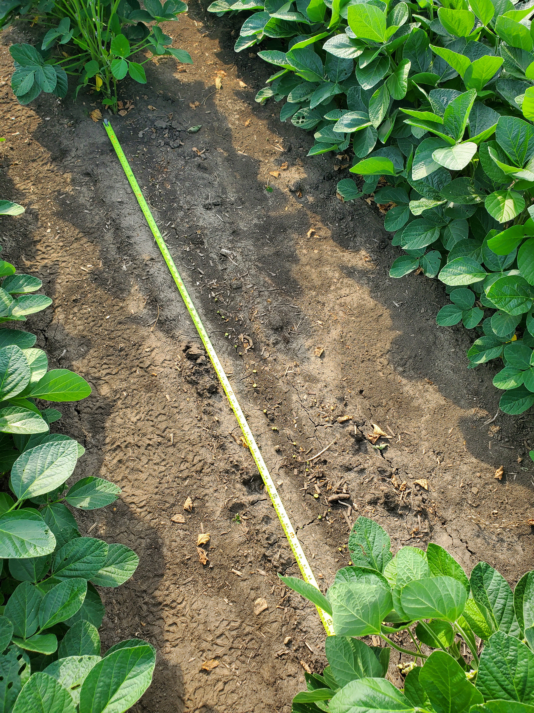
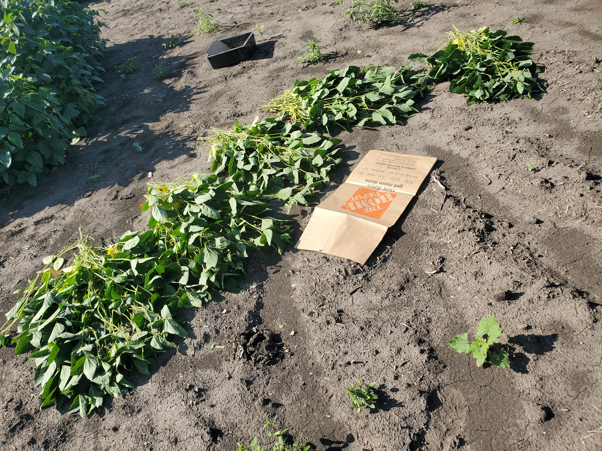
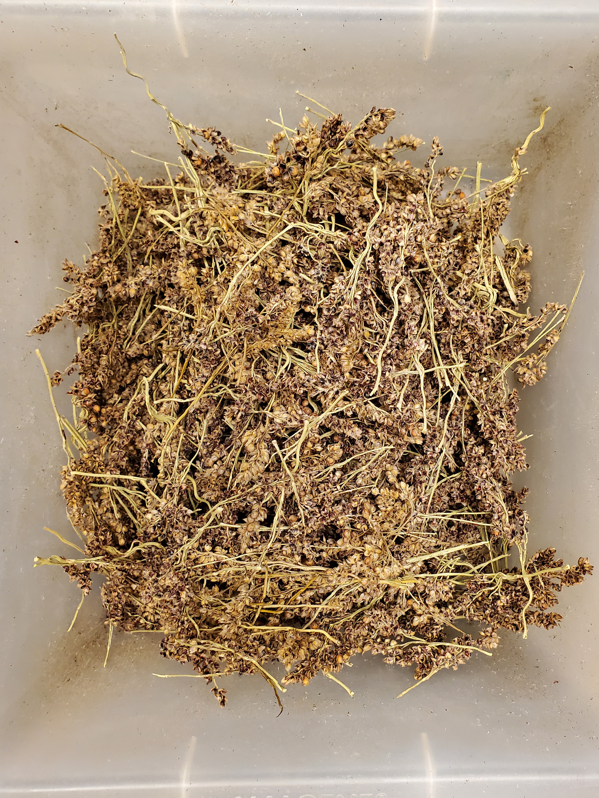

# Images from the Field

## Overview

This vignette shows some helpful example images that were taken while
harvesting and weighing tissue. This vignette is a work in progress, and
more images will be added in the future.

## Harvesting Plant Tissue

### Soybean Walkthrough

This section illustrates the key harvest steps using soybean as an
example.

1.  Measure out two meters from one of the inner rows and cut the stems
    just above the ground. If a litter trap is not present, also collect
    any litter on the ground that can clearly be associated with the
    plants that were cut.

2.  Count and collect the plants, and then fold them and put them in a
    large lawn bag. When the plants are dense, it can be helpful to cut
    them in groups of ten and count them at the end.

3.  Record key information on the bag itself, including the number of
    plants and the length of the row section. This can be transferred to
    the harvest record sheet later.

### Harvesting Maize Ears

Large fertilized ears can be simply snapped off the stem. Unfertilized
ears are also harvested. They can be difficult to find if they have not
emerged or produced silks, but they can nevertheless be cut out of the
stems. The image below shows some unfertilized maize ears during a
harvest.

## Weighing Tissue

### Weighing Maize Ears

The kernels can be removed by hand from the husked cob.

### Weighing Sorghum Panicles

After weighing the intact sorghum panicles and threshing off the grain,
the next step is to remove and weigh the flowers. The image below shows
the flowers while they are being weighed.

The image below shows the remnants of the sorghum panicles after the
grain and flowers have been removed. These are essentially just segments
of the stem.

## Miscellaneous Field Considerations

### Protecting Sorghum Panicles

Flocks of starlings may eat the sorghum grain. To protect it, cover the
panicles with large “fruit protection bags.” These are mesh bags that
allow air flow but prevent bird damage. They are time-consuming to
attach, so they should only be placed on panicles in the middle two
rows. The image below shows a damaged panicle in the foreground, while
the panicles in bags are still in perfect shape.

