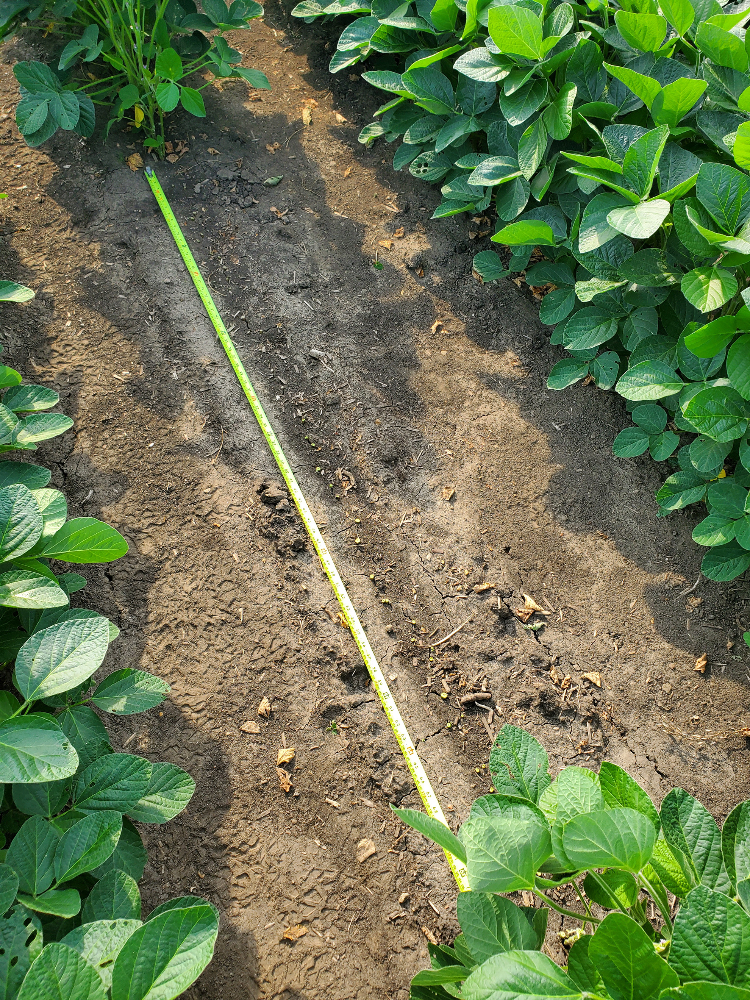
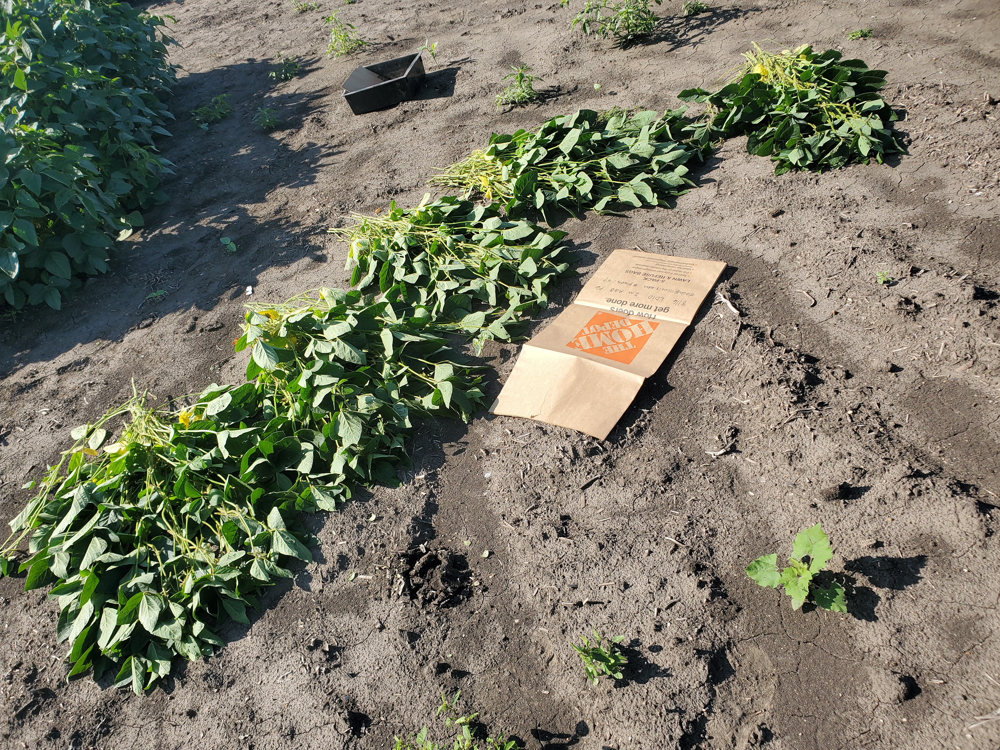
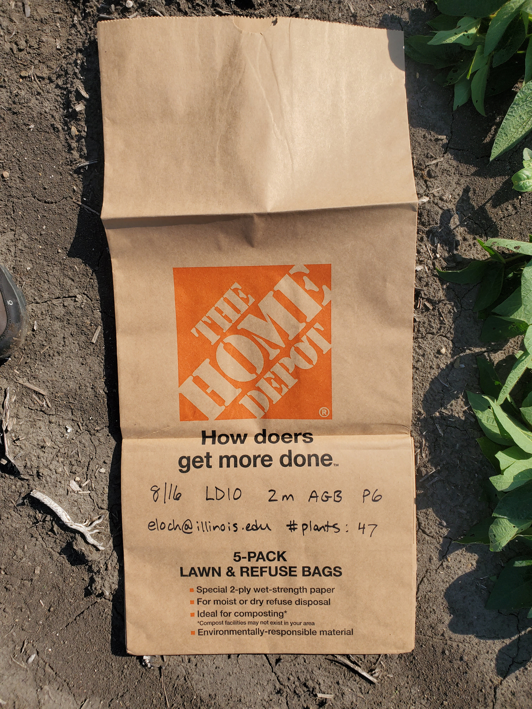
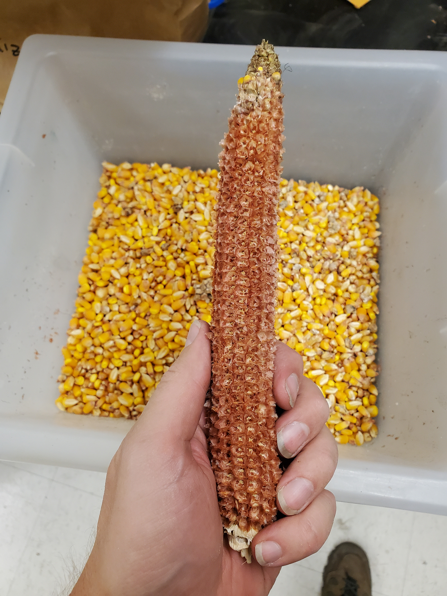
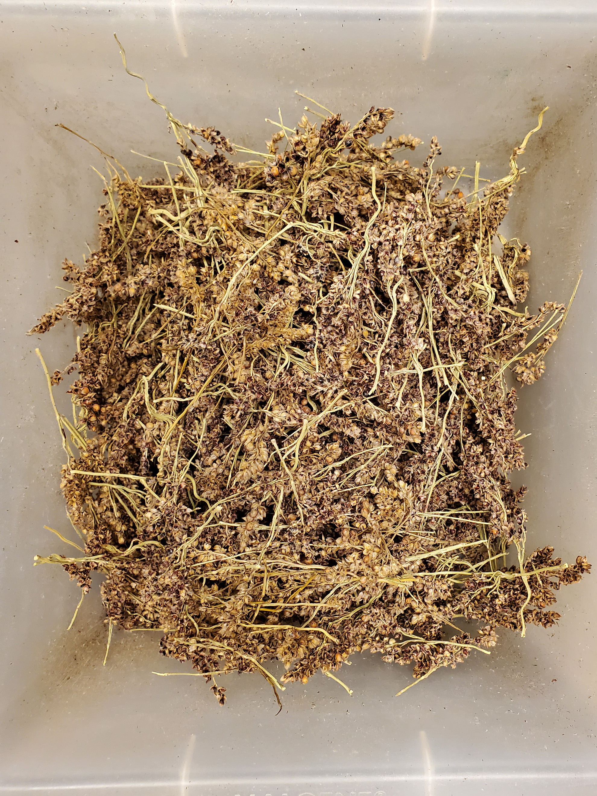
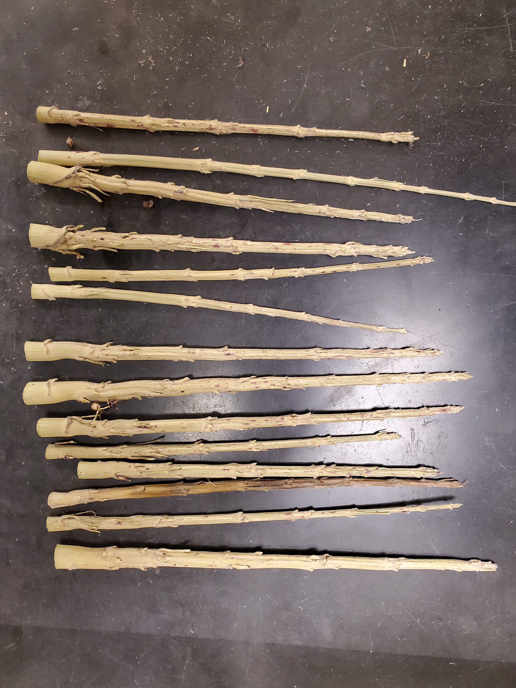

```{r, include = FALSE}
knitr::opts_chunk$set(
  collapse = TRUE,
  comment = "#>",
  fig.width = 5,
  fig.height = 5,
  fig.align = "center"
)
```

# Overview

This vignette shows some helpful example images that were taken while harvesting
and weighing tissue. This vignette is a work in progress, and more images will
be added in the future.

# Soybean Walkthrough

This section illustrates the key harvest steps using soybean as an example.

```{r abg_cutting, out.width = '50%', echo = FALSE}
#| fig.cap = "Measure out two meters from one of the inner rows and cut the
#|   stems just above the ground. If a litter trap is not present, also collect
#|   any litter on the ground that can clearly be associated with the plants
#|   that were cut."


```

```{r abg_collecting, out.width = '50%', echo = FALSE}
#| fig.cap = "Count and collect the plants, and then fold them and put them in a
#|   large lawn bag. When the plants are dense, it can be helpful to cut them in
#|   groups of ten and count them at the end."


```

```{r abg_bag, out.width = '50%', echo = FALSE}
#| fig.cap = "Record key information on the bag itself, including the number of
#|   plants and the length of the row section. This can be transferred to the
#|   harvest record sheet later."


```

# Processing Maize Ears

This section illustrates some steps involved with weighing maize ears.

```{r maize_cob_kernels, out.width = '50%', echo = FALSE}
#| fig.cap = "The kernels can be removed by hand from the husked cob."


```

# Processing Sorghum Panicles

This section illustrates some steps involved with weighing sorghum panicles.

```{r sorghum_flowers, out.width = '50%', echo = FALSE}
#| fig.cap = "After weighing the intact sorghum panicles and threshing off the
#|   grain, the next step is to remove and weigh the flowers. This image shows
#|   the flowers while they are being weighed."


```

```{r sorghum_panicle_stems, out.width = '50%', echo = FALSE}
#| fig.cap = "This image shows the remnants of the sorghum panicles after the
#|    grain and flowers have been removed. These are essentially just segments
#|    of the stem."


```
